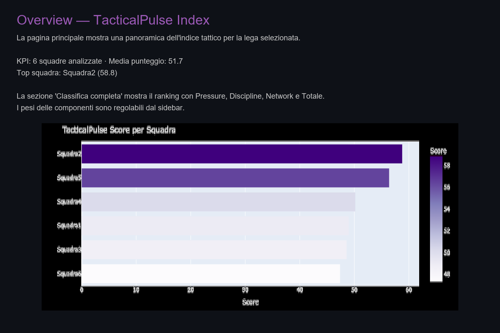
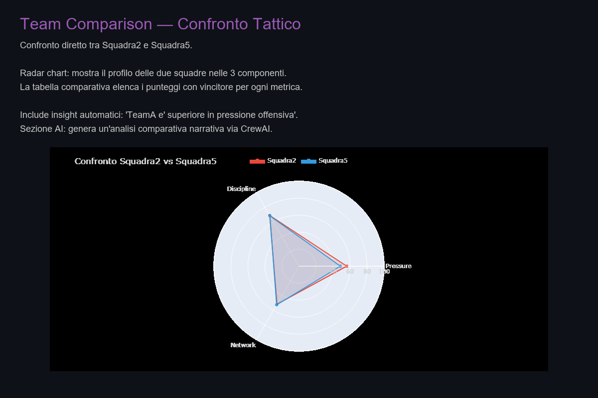
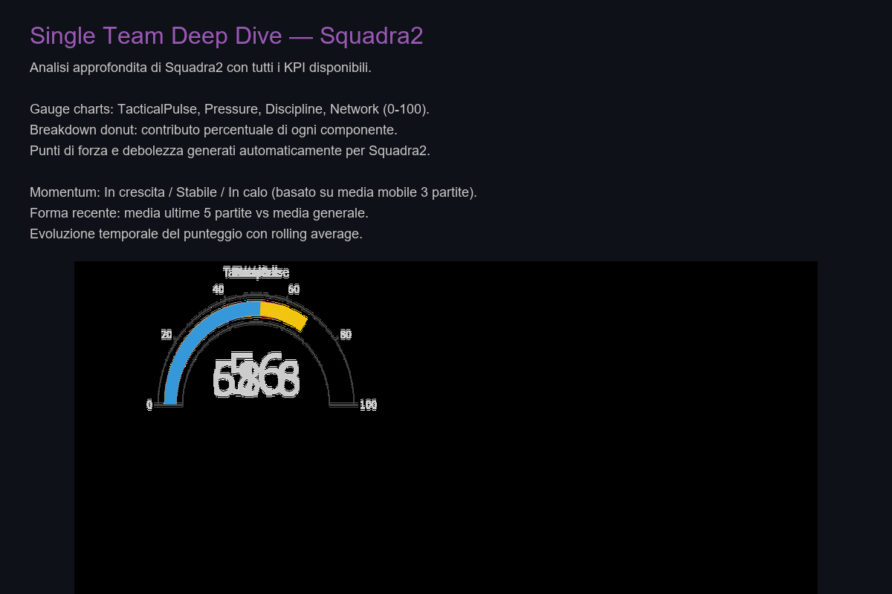
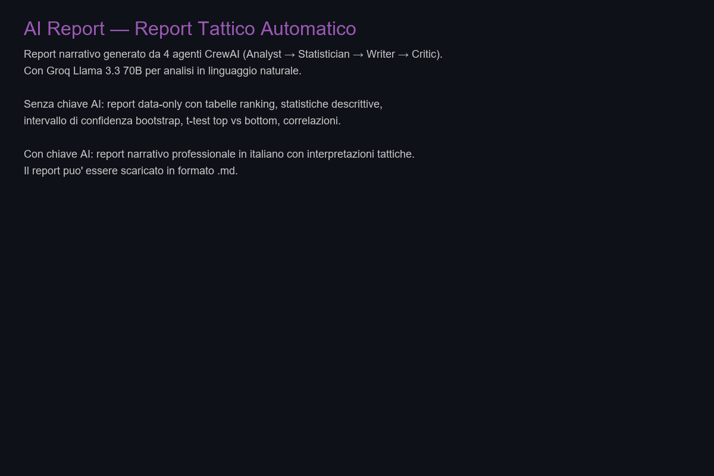
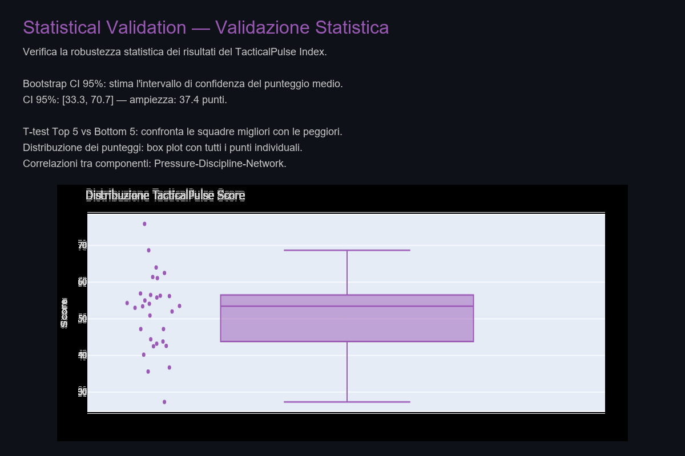

# Football Analytics Hub

Multi-league football analytics dashboard with tactical scoring, statistical validation, and AI-powered reports.

[](https://football-analytics-app-htvsmdq6xkqdbtjybuhtv2.streamlit.app/)

---

## Live Demo

[https://football-analytics-app-htvsmdq6xkqdbtjybuhtv2.streamlit.app/](https://football-analytics-app-htvsmdq6xkqdbtjybuhtv2.streamlit.app/)

The application works in data-only mode without any AI key configured.

---

## Highlights

- **Multi-league coverage** — Premier League, Serie A, La Liga, Bundesliga, Ligue 1 across three seasons (2022–2023, 2023–2024, 2024–2025)
- **TacticalPulse score** — Composite 0–100 index combining Pressure (offensive threat), Discipline (foul/card control), and Network (possession quality)
- **Multi-page dashboard** — Overview, team comparison, single-team deep dive, AI report, and statistical validation
- **Statistical validation** — Bootstrap confidence intervals, Welch's t-test (top vs bottom), and component correlations
- **AI-assisted reports** — Four CrewAI agents (Analyst, Statistician, Writer, Critic) generate narrative reports via Groq Llama 3.3 70B; data-only fallback always available
- **Data quality guardrails** — Automatic detection of anomalous team counts, missing critical columns, excessive cup-match filtering, and empty datasets
- **Cross-league contamination prevention** — Match logs filtered to league teams only; verified across five leagues and three seasons
- **CSV exports** — Rankings, team comparisons, and detailed per-match data
- **Local Parquet cache** — Downloaded data is cached for fast re-use across sessions

## Dashboard Pages

| Page | Description |
|---|---|
| **Overview** | League-wide KPIs, ranking table with tactical profiles, top/bottom teams, bar chart distribution, and automatic insights |
| **Team Comparison** | Head-to-head radar chart, component scores comparison, bar chart, and detailed match statistics |
| **Single Team Deep Dive** | Gauge charts, breakdown by component, timeline of score evolution, rolling averages, momentum indicator, and box plot |
| **AI Report** | Narrative report generated by four CrewAI agents (or data-only tables when no AI key is configured) |
| **Statistical Validation** | Bootstrap confidence intervals, top-5 vs bottom-5 t-test, score distribution box plot, descriptive statistics, and component correlations |

## Data Integrity

FBref match logs include fixtures from all competitions (league, domestic cups, European tournaments). Without filtering, cross-league contamination can occur when a team from one league plays against teams from other competitions.

The loading pipeline:
- Reads the official league team list for the selected season
- Retains only matches where **both** teams belong to the league
- Applies five data-quality guardrails: anomalous team count (<10 or >25), missing critical columns (Sh, SoT, Gls, Fls, CrdY, CrdR, Poss), excessive filter ratio (>30% rows removed), empty output after filtering, and pre-filter size tracking

Validation was performed on the five main leagues at the 2024–2025 season and on selected prior seasons (Premier League and Serie A 2023–2024, Premier League 2022–2023). No cross-league contamination was found.

## Tech Stack

- **Python 3.12** — Core language
- **Streamlit** — Dashboard framework
- **Pandas / NumPy** — Data manipulation
- **Plotly** — Interactive visualizations
- **soccerdata / FBref** — Football data source
- **SciPy / statsmodels** — Statistical tests (bootstrap, t-test, correlations)
- **CrewAI** — Multi-agent orchestration for AI reports
- **Groq API** — LLM backend (Llama 3.3 70B)
- **PyArrow / Parquet** — Local data cache
- **pytest** — Test framework

## Quick Start

```bash
# Clone the repository
git clone https://github.com/tuo-username/football-analytics-hub.git
cd football-analytics-hub

# Create and activate a virtual environment
python -m venv venv

# Windows
venv\Scripts\activate
# Linux / macOS
# source venv/bin/activate

# Install dependencies
pip install -r requirements.txt

# Launch the dashboard
streamlit run app.py
```

Open `http://localhost:8501` in your browser. Select a league, season, and match count in the sidebar, click **"Carica dati"** (Load Data), and navigate between the five pages.

**Prerequisites:** Python 3.12, Google Chrome (required by `soccerdata` for FBref access), and an internet connection for the initial data download.

## Optional AI Configuration

AI-powered narrative reports require a Groq API key. The dashboard works fully in data-only mode without one.

```env
GROQ_API_KEY=your_groq_api_key_here
```

1. Get a free key at [console.groq.com](https://console.groq.com/)
2. Copy `.env.example` to `.env` and insert your key (never commit `.env` to version control)
3. On Streamlit Community Cloud, set the key via the app **Secrets** interface
4. Restart the application

Without the key, the **data-only fallback** displays descriptive statistics and tables instead of narrative text.

## Project Structure

```
football-analytics-hub/
├── app.py                       # Streamlit dashboard (5 pages)
├── run_pipeline.py              # CLI entry point
├── AGENTS.md                    # Development conventions
├── README.md
├── requirements.txt
├── .env.example                 # Groq API key template
├── .gitignore
├── LICENSE                      # MIT
├── .github/
│   └── workflows/ci.yml         # GitHub Actions CI
├── .streamlit/
│   ├── config.toml              # Dark theme
│   └── secrets.toml.example     # Streamlit Cloud secrets template
├── core/
│   ├── config.py                # Shared env/secrets loader
│   ├── data_loader.py           # FBref download + Parquet cache
│   ├── pressure.py              # Pressure component (Sh, SoT, Gls)
│   ├── discipline.py            # Discipline component (fouls, cards)
│   ├── network.py               # Network component (possession, goals)
│   └── index_builder.py         # TacticalPulse composite score
├── agents/
│   ├── orchestrator.py          # CrewAI pipeline + data-only fallback
│   ├── analyst_agent.py
│   ├── statistician_agent.py
│   ├── writer_agent.py
│   └── critic_agent.py
├── stats/
│   └── significance.py          # Bootstrap, t-test, correlations
├── tests/
│   ├── test_core.py             # Core logic, league mapping, cup filter, guardrails
│   ├── test_config.py           # Env/secrets loading, key masking
│   └── test_dashboard.py        # Dashboard helpers, AppTest smoke tests, multi-league
├── data/raw/                    # Parquet cache (gitignored)
├── reports/output/              # Generated reports (gitignored)
└── docs/screenshots/            # Demo screenshots
```

## Testing

```bash
pytest
```

Tests are organized into three files:
- **test_core.py** — Data loading pipeline, league/cup filtering, data-quality guardrails, scoring components
- **test_config.py** — Environment variable loading, API key masking, AI configuration states
- **test_dashboard.py** — Helper functions, ranking table, table styling, AppTest smoke tests for all five pages, multi-league/season switching, team selector reset, AI report fallback

All tests use synthetic data and do not require a live FBref connection.

## Deployment

The live application is deployed on **Streamlit Community Cloud**:

[https://football-analytics-app-htvsmdq6xkqdbtjybuhtv2.streamlit.app/](https://football-analytics-app-htvsmdq6xkqdbtjybuhtv2.streamlit.app/)

Deployment preparation files:
- `requirements.txt` — All Python dependencies
- `.streamlit/config.toml` — Application theming
- `.env.example` — Reference for configuring the AI key locally
- `.streamlit/secrets.toml.example` — Reference for configuring the AI key on Streamlit Cloud

The `core/config.py` module reads `GROQ_API_KEY` from multiple sources in priority order: Streamlit secrets (cloud), `.env` file (local), environment variables (both), and `.streamlit/secrets.toml` (local fallback). The first source where a valid key is found wins.

## Known Limitations

- **Data availability** depends on upstream sources (FBref). Coverage may vary across leagues and seasons. Not all competitions or seasons are equally represented.
- **First load** requires downloading and parsing data via Chrome headless. Subsequent loads use the local Parquet cache and are much faster.
- **AI reports** require a valid Groq API key. The data-only fallback works without one and covers all dashboard features.
- **Network component** uses possession percentage and goals as a proxy for passing quality, because FBref does not expose detailed passing data for the covered seasons.
- **Cup filtering** relies on the league team list rather than an explicit competition column, because FBref does not expose a reliable competition identifier per match row in the aggregated `read_team_match_stats` output.

## Screenshots

| Page | Preview |
|---|---|
| **Overview** — KPIs, ranking with tactical profiles, bar chart distribution, automatic insights |  |
| **Team Comparison** — Radar chart, component breakdown, head-to-head statistics |  |
| **Single Team Deep Dive** — Gauge charts, score evolution, momentum, component breakdown |  |
| **AI Report** — Narrative report (AI) or descriptive tables (data-only fallback) |  |
| **Statistical Validation** — Bootstrap confidence interval, t-test, score distribution, correlations |  |

## License

MIT. See [LICENSE](LICENSE).
